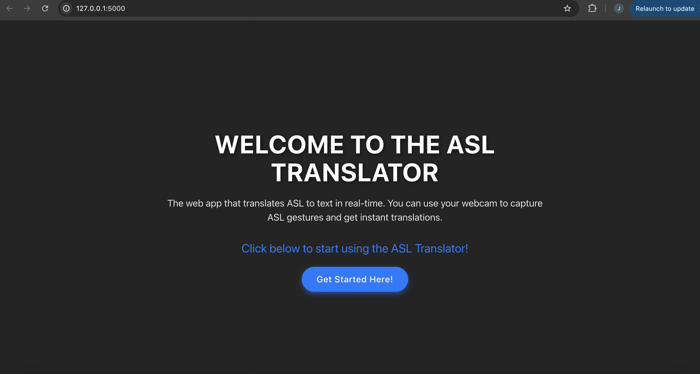
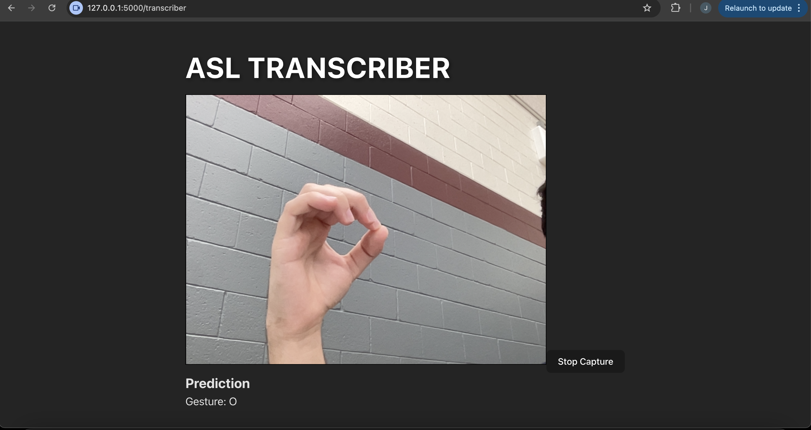

# ASL Translate
ASL Translate is a real-time American Sign Language (ASL) gesture translator. It uses a webcam to capture ASL gestures, processes them through a pre-trained model, and outputs the corresponding letter as text.

## Features
- Real-time ASL gesture recognition
- Web-based interface using JavaScript, CSS, and HTML
- Flask backend with a pre-trained image classification model
- Serves static React frontend files

## Technologies
- **Frontend**: JavaScript, CSS, HTML (React)
- **Backend**: Flask (Python)
- **Machine Learning**: Hugging Face Transformers, Image Classification Model (`Marxulia/asl_aplhabet_img_classifier_v3`)

## Home Page


## ASL Prediction


## Setup

1. **Clone the repository:**
   ```bash
   git clone https://github.com/Yahialqur/ASL_Translate.git
   cd ASL_Translate
   pip install -r requirements.txt
   python app.py
   ```
   The frontend is served through flask, you can access it by visiting http://127.0.0.1:5000/ after running the backend.

## Usage
- Ensure your webcam is connected and allowed in your browser
- Perform ASL alphabet gestures with your hand in front of the webcam
- The application will display the recognized letter in real time
- Keep in mind this is still a prototype so accuracy is not yet perfect
